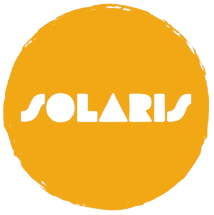

# 🌞 Solaris



> Proyecto para la semana cultural. Desarrollado con **Next.js** para realizar y documentar experimentos relacionados con la **energía solar**. 🌍☀️

## 🚀 Descripción

Este proyecto se enfoca en explorar diferentes aspectos de la energía solar a través de experimentos prácticos. Utilizando **Next.js**, la página proporciona información, resultados y documentación sobre cada experimento realizado. La finalidad es aprender sobre el potencial de la energía solar y cómo aprovecharla de manera efectiva.

## 🧩 Características

- 📊 Visualización de datos experimentales.
- 📋 Presentacion de datos sobre la energia solar.
- 📱 Diseño responsivo usando **Tailwind CSS**.
- 🔄 Actualizaciones dinámicas con **Next.js**.

## 🛠️ Tecnologías Utilizadas

- **Next.js** - Framework React para aplicaciones web.
- **Tailwind CSS** - Para un diseño responsivo y estilizado.
- **TypeScript** - Asegurando un código robusto y sin errores.

## 📂 Estructura del Proyecto

```bash
📦 solar-energy-experiments
├── 📁 components
├── 📁 public
│   └── logo.png
├── 📁 styles
│   └── 📄 globals.css
├── 📄 package.json
├── 📄 README.md
└── 📄 tailwind.config.js
```

## 🚧 Instalación y Uso
- Requisitos Previos
- Node.js y npm instalados.
- Git para clonar el repositorio.

Instalación
Clona el repositorio:
```bash
git clone https://github.com/tu-usuario/solar-energy-experiments.git
```

1. Instala las dependencias:
```bash
cd solar-energy-experiments
npm install
```

2. Ejecuta el proyecto en modo desarrollo:
```
```bash
npm run dev
```

3. Abre tu navegador en **http://localhost:3000**.

## 📜 Licencia
Este proyecto está bajo la Licencia MIT. Consulta el archivo LICENSE para más detalles.

💬 Contacto
Para más información o sugerencias, puedes contactarme a través de *luizkv4@outlook.com* o visita mi perfil de GitHub.

